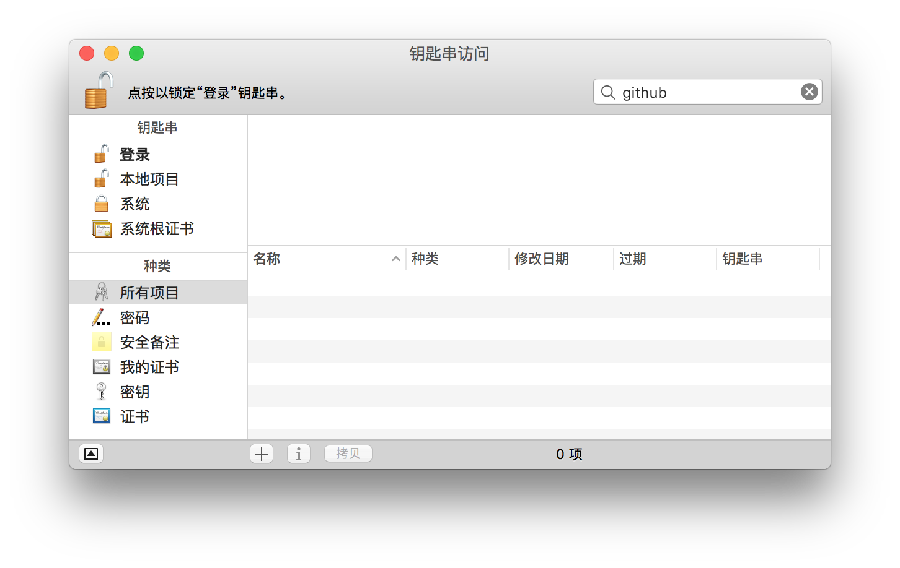
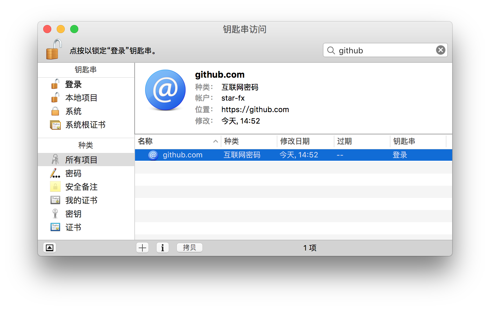
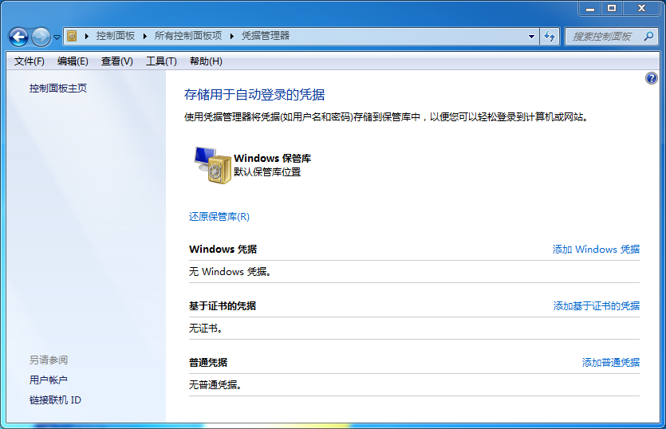
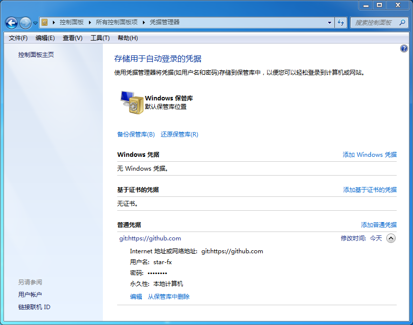

## git credential

> 首先声明几点，下文默认读者已经拥有以下技能：
> 1. 基础的svn和git使用技能
> 2. 熟悉OS X系统下[Keychain Access](https://en.wikipedia.org/wiki/Keychain_(software)软件的功能和基础使用
> 3. 熟悉Windows系统下[Credential Manager](http://windows.microsoft.com/en-us/windows7/what-is-credential-manager)软件的功能和基础使用（这里的Windows指Windows7以及更高的版本）


相信很多人在使用git时都会特别怀念svn命令中提供的`--username`和`--password`选项，
这是因为在git中没有提供类似的在执行命令时携带用户名和密码的方法。
git默认的做法是每次在需要用户名和密码时都交互式的询问用户，
这种做法显然是相当低效的，git也认识到了这一点，
所以git提供了2种内置的解决方案`store`和`cache`。但不管是哪种方案都有一个共同的前提，
git针对每个protocol和host的配对记录一次密码，
例如当git记录了“https://github.com”的用户名和密码后，
当再次遇到“http://github.com”或“https://www.github.com”还是会再次询问用户名和密码。

## store

store把用户名和信息以**明文**方式保存在文件中，配置方法如下：

```
git config --global credential.helper store
```

执行上面的命令后git会把用户名和密码保存在`~/.git-credentials`文件中，
如果希望自定义这个文件的路径，可以使用`--file`选项指定。

```
git config --global credential.helper "store  --file ~/.my-credentials"
```

## cache

cache把用户名和密码在内存中缓存一定的时长，过期后会重新要求用户输入，配置方法如下：

```
git config --global credential.helper cache
```

使用上面的配置会把用户名和密码在内存中缓存900秒，
这个时间过后git将会重新提示输入用户名和密码，当然可以使用`--timeout`选项来自定义这个时长，
使用如下的配置可以设置这个时长为一小时。

```
git config --global credential.helper "cache --timeout 3600"
```

了解到这儿，对于大部分用户已经完全够用了。但是如果你和我一样，
受不了使用**store**时的**明文**保存，也受不了使用**cache**时的无法做到永久保存，
那么下面分别介绍在OS X和Windows系统上的**增强**（加密永久保存）方案。

## OS X

在OS X上使用`brew`安装git时会默认安装一个叫`git-credential-osxkeychain`的命令，
这个命令可以提供一种把git的用户名和密码保存在`Keychain Access（钥匙串访问）`软件中的功能，
使用如下命令即可完成由Keychain Access来**加密保存**和提供git的用户名和密码。

```
git config --global credential.helper osxkeychain
```

例如我本机的Keychain Access中在使用以上配置前搜索`github`时没有结果。



在使用以上命令并且完成第一次输入用户名和密码后搜索`github`时在keychain中已经存在记录。



这样以后每次git需要用户名和密码时将会由Keychain Access来提供给git，无需用户再次输入。

## Windows

在Windows上也有类似于OS X上Keychain Access的软件，
叫做`Credential Manager（凭据管理器）`，可以在`Control Panel（控制面板）`中找到。
但这个软件无法直接和git通信，
所以微软在自己的github上开源了一个叫做[Git-Credential-Manager-for-Windows](https://github.com/Microsoft/Git-Credential-Manager-for-Windows)的软件（以下统一使用官方简称GCM），
这个软件实现了和在OS X中的git-credential-osxkeychain类似的功能，
用来在git和Credential Manager之间做通信。

例如我本机的Credential Manager在使用GCM前没有任何记录。



在使用了GCM并且完成第一次输入用户名和密码后出现了一条记录。



这样以后每次git需要用户名和密码时将会由Credential Manager来提供给git，无需用户再次输入。
