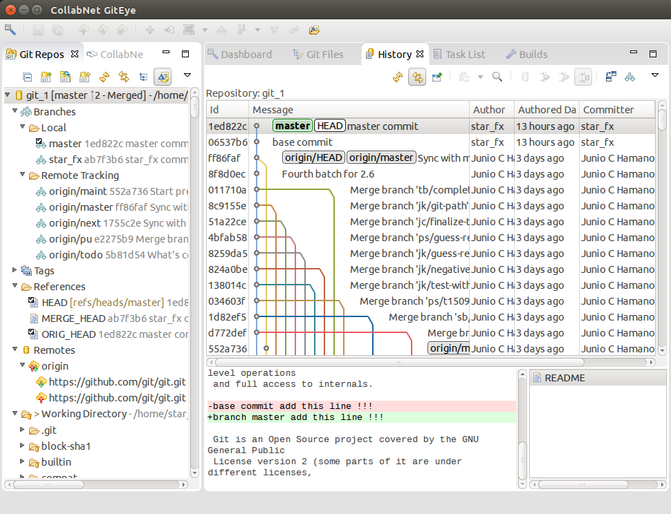

# git图形化工具

git的图形化工具非常多，这里有一个[官方列表](http://git-scm.com/downloads/guis)搜罗了几乎所有知名的git图形化工具。

经过一段时间的使用，个人认为[**sourcetree**](http://git-scm.com/downloads/guis)是非常好用的一款软件。

## sourcetree

sourcetree是[Atlassian](https://www.atlassian.com/)公司推出的一款免费（没开源）软件。
它支持windows和osx这两个平台（可惜不支持linux），并且同时支持git和mercurial这俩款软件。

附上一张sourcetree的截图：

如果你工作在windows下或osx下，这款软件将会是非常好的选择。

## giteys

前面提到的sourcetree可以运行在windows和osx下，但是在linux下却没有对应的版本。
假设在linux下确实需要使用图形化git工具，我建议使用 [**giteye**](http://www.collab.net/products/giteye) 这款软件。

附上一张giteye的截图：

在linux下功能强大的图形化git工具不多，giteye是很好用的一款软件。
