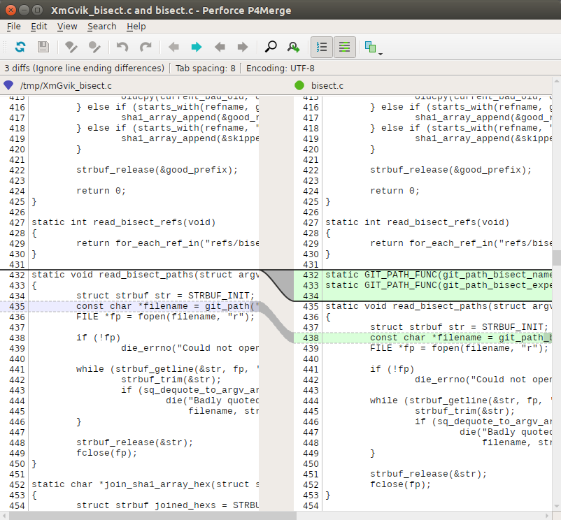
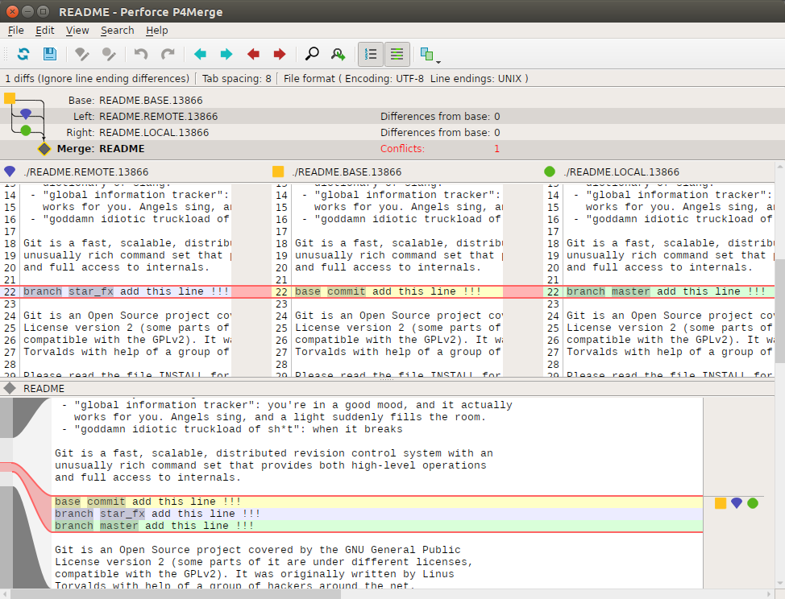

# git可视化diff与merge工具

git支持很多种diff和merge工具，可以使用下面的命令查看。

```shell
git difftool --tool-help
# or
git mergetool --tool-help
```

命令输出如下：

```shell
'git difftool --tool=<tool>' may be set to one of the following:
		araxis
		vimdiff
		vimdiff2
		vimdiff3

The following tools are valid, but not currently available:
		bc3
		codecompare
		deltawalker
		diffmerge
		diffuse
		ecmerge
		emerge
		gvimdiff
		gvimdiff2
		gvimdiff3
		kdiff3
		kompare
		meld
		opendiff
		p4merge
		tkdiff
		xxdiff

Some of the tools listed above only work in a windowed
environment. If run in a terminal-only session, they will fail.
```

以上输出的含义是araxis， vimdiff, vimdiff2, vimdiff3这几个工具已经安装在我们的系统上，可以直接使用。
下面列出的其他的工具git也可以支持，但是还没有被安装到系统中。

那么这么多的工具哪个最好用呐？根据我自己的体验， `p4merge` 是最好用的一个。
多提一句，不要被p4merge这个名字误导，以为它只能做merge，它也可以做diff的。

## p4merge

p4merge是 [**perforce**](http://www.perforce.com/) 这家公司出品的叫perforce的软件旗下的一个免费（没开源）工具。
这里必须提一下,在商业VCS（Version Control System）领域，perforce是绝对的第一，没有之一。

## 安装与配置

首先在perforce的官方网站下载到p4merge的包（已经是编译好的二进制文件）。
解压包的内容到一个目录下，我这里解压到我本机的 `/usr/local/p4v/` 目录下，p4merge的绝对路径是 `/usr/local/p4v/bin/p4merge` 。

想要让git识别p4merge需要进行如下配置：

```shell
git config --global merge.tool p4merge
git config --global mergetool.p4merge.path "/usr/local/p4v/bin/p4merge"
```

这里可能有人会问为什么没看到有关diff的配置，这是因为git的merge配置会默认应用到diff上，所以只需要配置merge即可。

## 两个场景

使用可视化diff和merge工具的两个主要场景就是查看版本之间的diff信息和在merge冲突后通过可视化的视图来解决冲突。

### diff

首先执行下面的命令来查看master分支上最新的提交和倒数第二次提交的diff。

```shell
git difftool master^ master
```

GUI截屏如下：



从图上可以很直观的看到文件在不同版本的diff。

### merge

当执行 `git merge <branch>` 产生冲突后，执行下面的命令来查看冲突后的场景。

```shell
git mergetool
```

GUI截屏如下：



解释一下这个图，上半部分分为3块，中间一块是本次合并的代码基，也就是两个分支的共同祖先commit的内容。
左边一块是要合并的分支 `<branch>` 的内容。右边一块是当前分支的内容。
下半部分是合并后希望产生的最终内容。可以方便的通过右面的几个图形来动态选择希望的内容。

## 几个选项

当执行 `git difftool <ref-a> <ref-b>` 时git会提示：

```shell
Viewing (1/1): 'Documentation/RelNotes/2.5.1.txt'
Launch 'p4merge' [Y/n]:
```

如果希望不要每次都出现这个提示，可以使用 `-y | -Y | --no-prompt` 参数来告诉git不要提示。
这个选项同样适用于执行 `git mergetool` 时出现的提示。

当执行 `git mergetool` 然后从p4merge里退出来以后，git会询问：

```shell
Was the merge successful? [y/n]
```

这是因为git不知道用户有没有在p4merge中解决掉冲突，所以才会询问用户，可以使用 `--trust-exit-code` 选项来告诉git读取p4merge的返回值来确定成功与否。

当执行 `git mergetool` 然后从p4merge里退出来以后，发现在冲突的文件（假设叫 README）的同名目录下多出来一个 `README.orig` 的文件。
保留冲突文件的原始内容是git的默认逻辑，如果希望不要保存，可以使用以下配置来避免：

```shell
git config --global mergetool.keepBackup false
```

这样git就不会再自动产生 `.orig` 文件了。

## 官方文档

有关 **p4merge** 更多的内容请执行 `/path/to/p4merge -h` 了解。

有关 **git difftool** 更多的内容请到 [git官方文档-git-difftool](http://git-scm.com/docs/git-difftool)了解。

有关 **git mergetool** 更多的内容请到 [git官方文档-git-mergetool](http://git-scm.com/docs/git-mergetool)了解。
